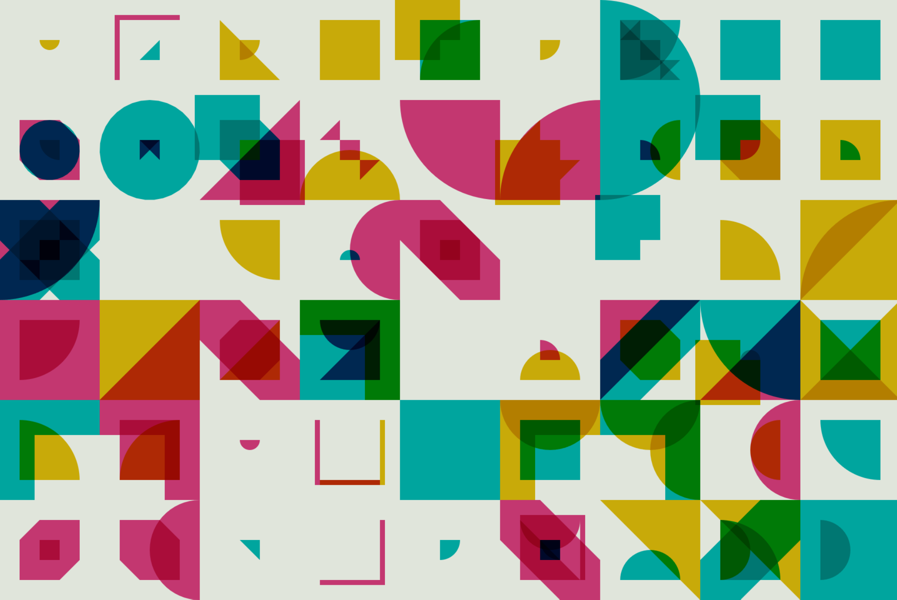

# **Research Report**
## Imaging Technique Inspiration
- 两张高质量截图或图像
- 100字说明理由和选择借鉴方向
## Coding Technique Exploration
- ****
- **[Code link](https://openprocessing.org/sketch/2211491)**
- **Reason**
   1. Utilizing functions like:
    ```
        nowColorSet = getRandomColorSet();
        nextBGColor = nowColorSet.bgColor.color”
    ```
        bgFillColor = NYLerpColorRGBA(nowBGColor, nextBGColor, animatedT);
    ```
        nowBGColor = nextBGColor;
        bgFillColor = nowBGColor;
    ```
    to control *the color of picture*.

   2. It utilizes *arrays and if&while* to create complex graphics, altering animation effects based on *random number conditions*，and adjust the layout based on the window width and height.
   
   3. It checks whether *mouse interaction* is enabled depending on the device using:
    ```
     // if not mobile, enable mouse interactive
        MOUSE_INTERACTIVE = !checkIsMobile();
        possibleEasings = [
        easeInOutSine, easeInOutQuad, easeInOutCubic,
        ];
    ```
    and ensures that elements on the screen can interact with the mouse position.

   4. It controls the overall and local *program execution time* using the "sleep(ms)" function and "await sleep()".
      