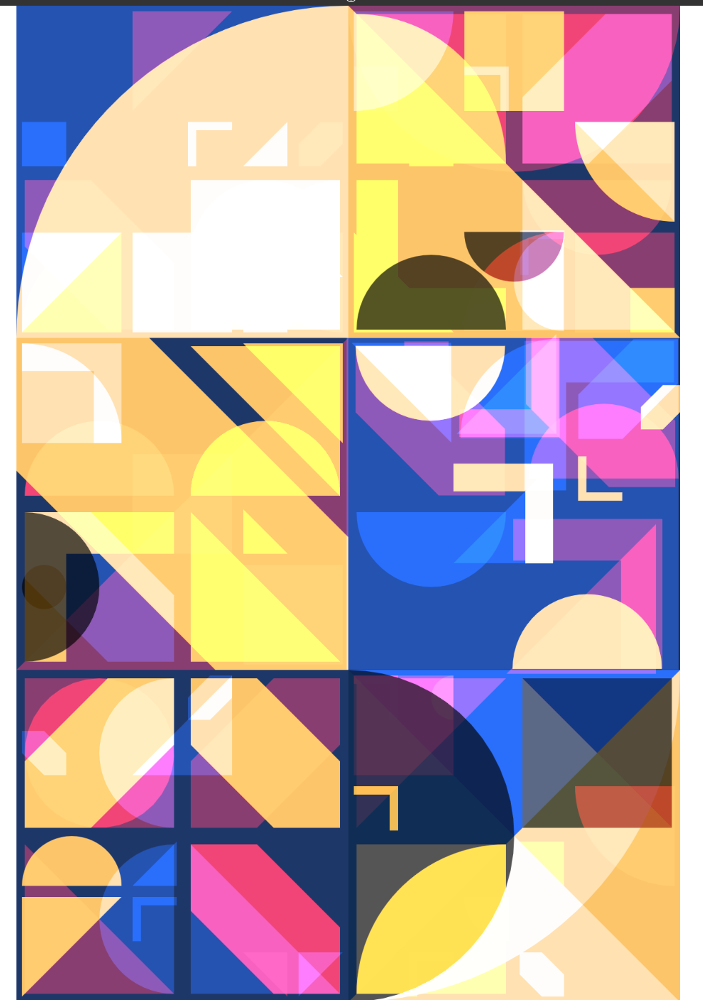
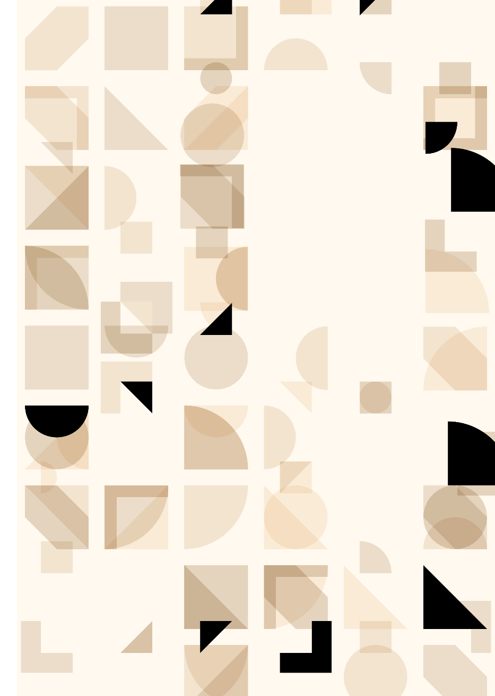

# **Research Report**
## Imaging Technique Inspiration
- *Picture 1*
- *Picture 2*
- **Reason**
    1. Different layouts and transitions between elements are designed in the animation, demonstrating a method of dividing the screen into multiple sections.

    2. Colors are randomly generated, but the color combinations are harmonious and controllable.

    3. Local mouse interaction is implemented without affecting the overall animation.

    4. Different layout schemes are chosen based on the window's width and height.

    5. Different parts of the animation change at different speeds, and the overall animation stops or changes within a certain period of time.

## Coding Technique Exploration
- *[Code link](https://openprocessing.org/sketch/2211491)*
- **Reason**
   1. Utilizing functions like:
    ```
        nowColorSet = getRandomColorSet();
        nextBGColor = nowColorSet.bgColor.color”
    ```
        bgFillColor = NYLerpColorRGBA(nowBGColor, nextBGColor, animatedT);
    ```
        nowBGColor = nextBGColor;
        bgFillColor = nowBGColor;
    ```
    to control **the color of picture**.

   2. It utilizes arrays and if&while to create **complex graphics, altering animation effects** based on random number conditions，and adjust the **layout** based on the window width and height.

   3. It checks whether **mouse interaction** is enabled depending on the device using:
    ```
     // if not mobile, enable mouse interactive
        MOUSE_INTERACTIVE = !checkIsMobile();
        possibleEasings = [
        easeInOutSine, easeInOutQuad, easeInOutCubic,
        ];
    ```
    and ensures that elements on the screen can interact with the mouse position.

   4. It controls the overall and local **program execution time** using the "sleep(ms)" function and "await sleep()".
      