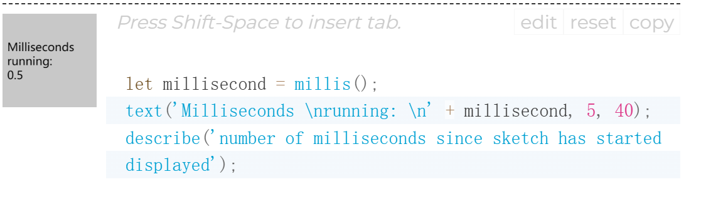

# **Research Report**
## Imaging Technique Inspiration
- *Picture 1*
    [link](https://openprocessing.org/sketch/2211491)

- **Reason**
    - I noticed that the animation in this work is not updated according to the draw function, and it will stay for a while after generating a new image and then change. 

## Coding Technique Exploration
- 
    - [code link](https://p5js.org/zh-Hans/reference/#/p5/millis)
- 
    - [code link](https://stackoverflow.com/questions/67221313/how-to-wait-in-p5-js)

- **Reason**
   - Although the original image animation is generated by async/await functions, it is a bit too complicated for me. Maybe a foor loop and if statements can also be used to simply draw different stages of the animation and reset the screen according to the state of millis(). 
   - For example, call the different functions to draw the image every 1000 seconds. Keeping all elements still in a certain part to achieve a short stagnation.

   